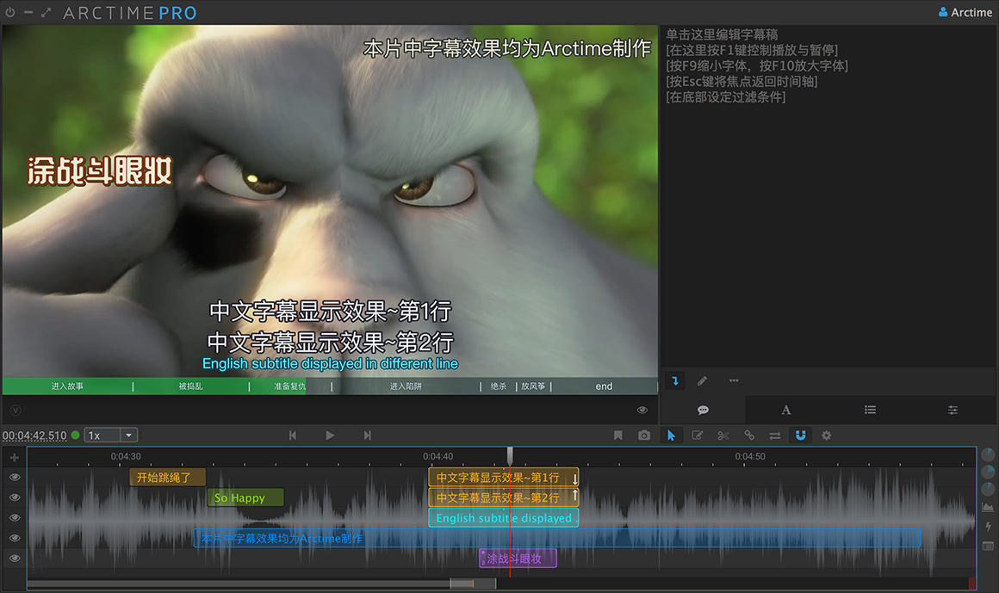
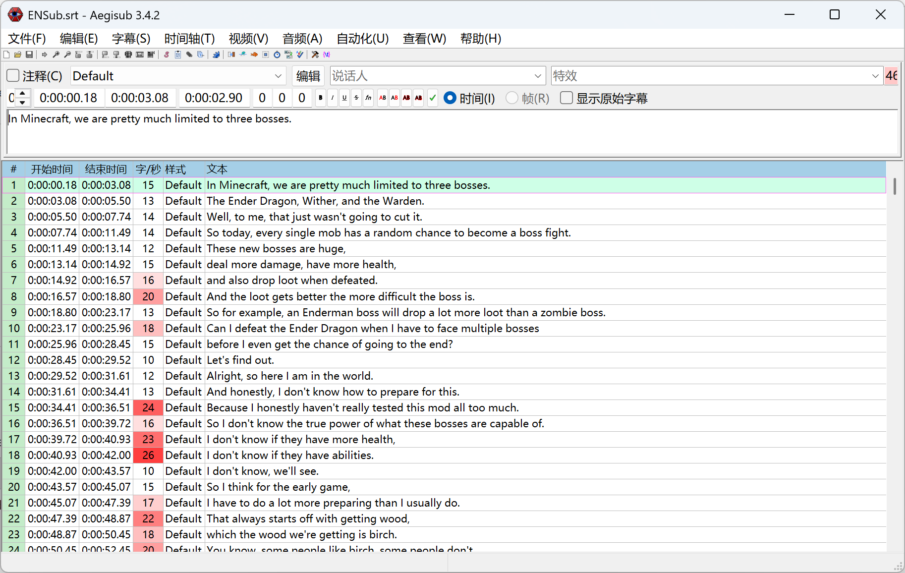
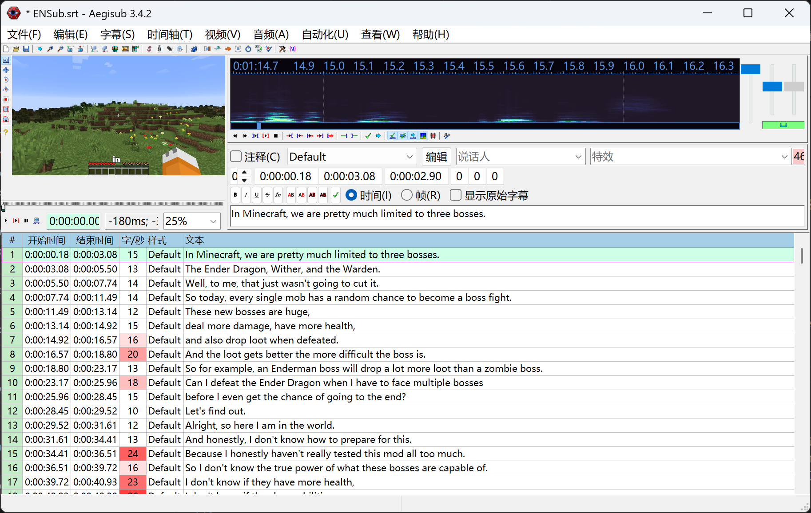
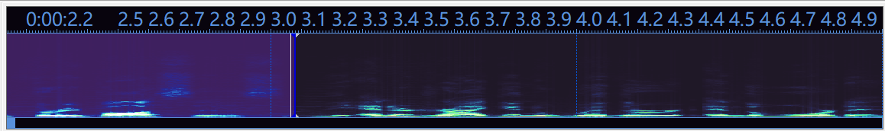

# Aegisub 简介

Aegisub 是一款用于字幕打轴和样式管理的开源软件。

## Aegisub 的优势

Aegisub 的功能相当全面，且拥有一些同类软件无法取代的功能：

### 字幕为主，视频为辅

以 ArcTime Pro 为例，它的主编辑界面更像是传统的剪辑软件分离出了字幕编辑的单例，而 Aegisub 在不导入视频时完全是文字面板，导入后也可以随意调整大小：

=== "ArcTime Pro"

    

    /// caption
    ArcTime Pro 的主编辑界面
    ///

=== "Aegisub（未导入视频）"

    

    /// caption
    Aegisub 的主编辑界面（未导入视频）
    ///

=== "Aegisub（导入视频）"

    

    /// caption
    Aegisub 的主编辑界面（导入视频）
    ///

因此，可以说 Arctime Pro 更适合做字幕特效，而非打轴，但打轴也很耗时。事实上，单论打轴，Aegisub 的功能几乎无可替代。

### 全面的功能

Aegisub 中可以选中某一条或几条字幕，围绕选中的字幕有一系列快捷功能可用：

- 仅播放该条字幕的声音/视频；
- 播放该条字幕的前/后 0.5 秒；
- 播放该条字幕开始前/结束后的 0.5 秒；
- 合并相邻两条字幕；
- 根据视频播放的时间位置（可手动拖动）将一条字幕分为两部分；
- 在当前字幕前/后插入一条自动填充到前/后一条字幕的新字幕；
- 将当前字幕的开始时间对齐上一条字幕结尾，或当前字幕的结束时间对齐下一条字幕开头。

这些小功能很有利于打轴，而其他软件或许有个别类似功能，但大多不全面。

### 频谱图

Aegisub 相比于其他软件有个特色：频谱图。在加载音频或视频时，界面上方会出现这样一条图像：

///caption
Aegisub 的频谱图
///

这种图可以同时反映发生的响度和频率，频率越高，图像越靠上。

常见的语音识别 AI 都无法很好把握英语中常见的爆破音，而爆破音在频谱图中往往又呈现为一段位置偏高的高亮，大量实操、熟悉规律后，甚至不用听就可调整。

## Aegisub 的劣势

### 代码问题

Aegisub 项目立项已久，无论是 Windows 还是 macOS 上都颇不稳定。官方仓库早已停更，第三方维护者近来倒是更新频繁，但至今正式发布的版本还停留在 2025 年 1 月的 3.4.2。

!!! info "3.5.0 发布在即？"
    2025 年 11 月，开发者在 Github 上创建了一条新 issue，说明 3.5.0 版本的发布计划。但直到现在，3.5.0 版本都遥遥无期。[点击这里][issue-3.5.0]可以前往 issue 的页面查看。

[issue-3.5.0]:https://github.com/TypesettingTools/Aegisub/issues/475

首先，如果你是 macOS 用户，几乎可以确认，你无法使用 Aegisub 了。最新的 3.4.2 版本中，中文输入法存在 BUG，候选框会强制显示在全屏的左下角，输入框中也没有显示为英文的候选字；如果回退到 3.2.2 版本，触控板在音频编辑界面的灵敏度又过高，偏偏 Mac 用户很依赖触控板，导致软件几乎不可用。

那假如你是 Windows 用户，又是否能通行无忧呢？也不一定。虽然 Aegisub 的 Windows 发布版本是 x64 的，但实际应用是 32 位，打开后字体极为模糊；而如果你采用应用程序高 DPI 兼容，又不可避免会导致涉及图标的 UI 变得极小无比，屏幕尺寸小于 16 寸就几乎不可用。

Linux 系统下，个人暂未测试过，但可以预见，体验不会太好。

此外还有一些共性 BUG，有时甚至会导致程序崩溃。比如在调整编辑框的显示字体时，点按 Apply 有概率导致程序直接崩溃，打轴进度直接回档到最近一次的自动保存，而不巧自动保存又是 .ass 格式，还需要导出而不是另存为，更是平添麻烦。

### 功能繁杂

前面说过，Aegisub 的功能十分丰富，但反过来就是繁杂，需求轻量的用户容易望而却步。而且因为 Aegisub 软件较老，某些图标代表的实际功能和图标可能没太大关系，导致用户更难上手：

{width=300}

/// caption 
很难想象，这条金鱼实际功能是翻译助手，也就是一个专门用来输入译文的小窗
///