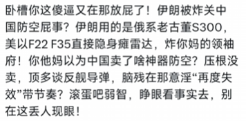

# 关于 AI 的使用

你可能对哔哩哔哩上那位著名的 “赛博普罗米修斯” —— 黑纹白斑马有所了解。你应该很好奇，AI 到底能胜任多少翻译工作？

如果你想保证翻译的质量有至少中上的水平，那么 AI 暂时不能全权负责任何一个环节。[流媒体翻译的难点](./streaming-media-translation.md/#streaming-media-translation-difficulties)相当特殊，即使你翻译过传统的文学作品，也未必能立刻上手。但同时，不少同行极端排斥 AI。本百科对 AI 的态度是：**AI 可以辅助译者提升工作效率，但译者必须参与翻译，以弥补 AI 的缺陷。**

## 字幕识别及打轴

字幕识别可以由 AI 来初步完成，这样能省去大量工作量，但即使是最通用、综合性能最好的 Whisper，也无法全权负责。

首先，Whisper 无法确保下一句的一部分不被划分到上一句去。换言之，我上面这段话，类比成 Whisper 识别英文并直接输出的场景，可能会是这样：

```
首先，Whisper 无法确保下一句
的一部分不被划分到上一句去。换言之，
我上面这段话，类比成 Whisper 识别英文
并直接输出的场景，可能会是这样：
```

这样的断句明显不符合语言习惯。

其次，就算没有发生上述的错误，Whisper 英文的断句也无法承接后续的中文翻译。英文中长句很多，而长句拆分后，因为语序习惯差异，中文每一小句的语义可能需要重排，每秒字数也可能过高，需要反复斟酌，甚至译者都开始翻译中文字幕了，还可能回过头去调整英文字幕的分句。更何况，它有概率把整个长句**原封不动直接输出**，严重违背字幕长度的一般限制，导致译者还要额外手动分句。

!!! tip "字幕长度和语速的限制"
    一般来说，单条英文字幕不宜超过 60 个字母，否则建议分句；单条中文字幕不宜超过 13 个字，如果超过，也务必保证语速不超过 6 字/秒。

此外，单句内每句的气口，Whisper 也掌握不好，句末的 /s/ 和 /t/ 等爆破音经常被划分到下一句，如果不加任何修改，观众听起来会很难受。（当然，**假如听不到，或者观众足够愚蠢**，也就无所谓了，黑纹白斑马就是如此成功的。）

最后，Whisper 无法指定翻译的领域，如果恰逢原视频作者语音含糊，就可能识别成完全无关的内容，肯定需要人工复核。

## 字幕翻译

AI 翻译需要用到 LLM，而 LLM 可谓是人类迄今为止输入语料最广泛的 AI。那它能否胜任翻译的工作呢？答案是，不完全能。

### 翻译风格

LLM 无法稳定输出某一特定的翻译风格。譬如，“口语化风格”。“口语化” 并没有通解。设想一下，你会怎么用“口语化”的语言回复下面这个问题呢？

!!! question "\[plain\]抛开事实不谈，你难道没有任何错误吗？"

人类可能回复以下内容（但不仅限这些内容）：

- 666事实都能抛开
- 那还说啥了，算你赢了
- 下次抛开老冯不谈可以不宝子

而显然，不同人的 “口语” 习惯也并不一致，结果 “口语化” 输出的效果非常不稳定。书面用语和口头用语并非完全对立，但 AI 无法理解这一模糊的关系。时至今日，用户让 Grok 模仿贴吧用户的风格发言，Grok 还是只会满嘴 “卧槽”，仿其形而失其魂。


/// caption
Grok 的回复
///

然而用 AI 生成文本时，“口语化” 这个提示词反而最有效，换作其他提示词，生成结果只会更差。如果你提示 AI “书面化”，那生成的文字可能染上严重的 “翻译腔”；如果你提示它具体人物的发言风格，要么效果不尽人意，反而不如完全不给提示词，要么可能涉嫌侵犯名誉权、违反其他规则而失败。

### 新造词汇

互联网尤其热衷于新造词，而英文又往往用短单词和词根组词，AI 很难处理。比如 Spleef，这是 Minecraft 中的一种小游戏。它到底是什么呢？答案是：这个词由 splat（拟声词，玩家掉下落到下一层平台时的啪嗒声）和 grief（破坏）拼合而成，中文名即大名鼎鼎的 “掘地求生”。

当然，单论这一个例子，AI 完全能正确回答。但是，Minecraft 玩家甚众，而 “掘地求生” 早在 2009 年 Minecraft Classic 测试版期间就问世了，如果新造词极新，领域极小众，AI 则很可能答错。因此一定要人工查资料，即使查资料也用 AI 辅助，也要点进提供的参考链接查证 —— AI 可能提供完全不存在或者早已失效的链接。

### 领域词库

互联网包罗万象，而 AI 照单全收。但如果一个领域的语料过少，AI 就可能 “遗忘”。此时，某些非主流领域就算有正式翻译，也可能出现大量错误。

例如 knot，绳结，但在航海业中指航速，即 1 海里/秒。此时若不加以提示，AI 就可能翻译错误。而且由于 AI 存在幻觉，即使用户在提示词中列出完整的术语表，AI 也可能忘记指示，从而出错。

在个人的少量实践中，这样的错误往往太多，以至于 AI 翻译加上纠错时间后，反而比完全人工更低效。因此，本百科不太建议 AI 翻译先行、人工校对次之。

### 语序文法

LLM 在训练时输入了大量语料，其中不乏带着所谓 [“翻译腔”][translate-tone] [“欧化中文”][westernised-chinese] 的语料，导致 LLM 输出的内容也往往不通顺。但人如果先看到 AI 预翻译的语料，可能无法第一时间发现问题并纠正。不过，即使译者选择全人工翻译，犯的问题也可能无法第一时间纠正，这时建议 [把文本先放一边，过一会儿再看][put-text-aside]。

[put-text-aside]:./appendix-translate-tone.md#language-sense-first
[translate-tone]:./appendix-translate-tone.md
[westernised-chinese]:./appendix-westernised-chinese.md