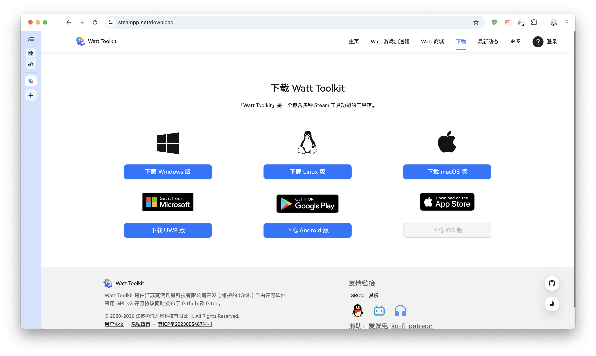
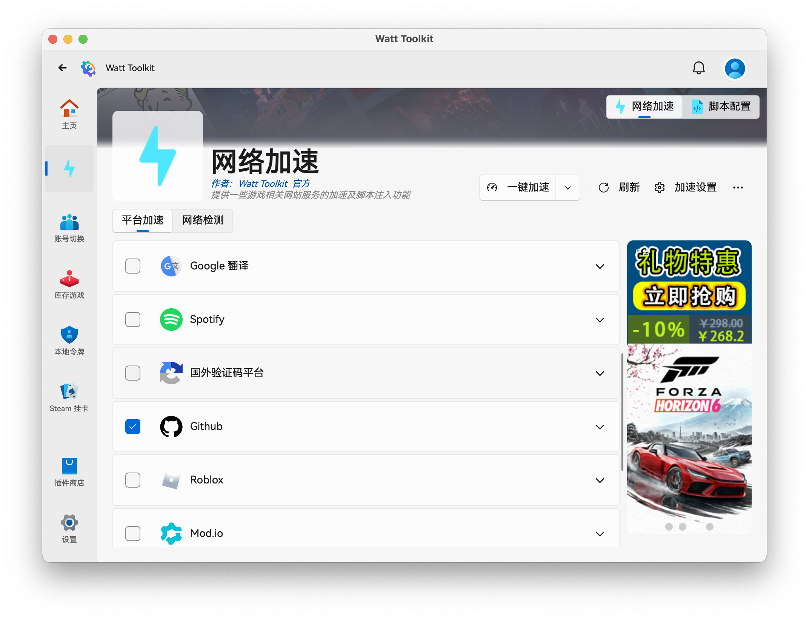

# Watt Toolkit 简介

Watt Toolkit 本来是一款游戏加速工具，用于加速 Steam 等游戏平台。但它也可以加速 Github，因此意义很大。

由于使用较为简单，本栏目不设子文章，一次讲完。

## 下载

点击 [这里][downloads]，前往 Watt Toolkit 的下载界面。

/// caption
Watt Toolkit 的下载界面
///

由于 Watt Toolkit 没有独立的软件分发服务器，因此需要转接其他平台或网盘下载。~~这里建议选择蓝奏云盘渠道，但也不强制，看情况选择。~~

[downloads]:https://steampp.net/download

!!! warning "蓝奏云链接已失效"
    蓝奏云有 200 MB 的单文件限制，链接现已失效。德国转发链接似乎也已失效。请使用其他下载渠道。

下载后安装即可。

## 使用

打开软件，点击左侧的闪电符号（网络加速）。此时中间会出现可加速的栏目，默认勾选了部分 Steam 的服务。建议在加速 Github 时取消勾选 Steam。下拉菜单，看到 Github 后，勾选，点击上方的开始加速即可。

/// caption
Watt Toolkit 的加速界面
///

!!! info "泛 Unix 系统的权限设置"
    泛 Unix 系统（Linux 和 macOS）可能会阻止 Watt Toolkit 正常运行。此时请 [打开此链接][unix-host-access]，按照指示操作即可。

[unix-host-access]:https://steampp.net/unixhostaccess